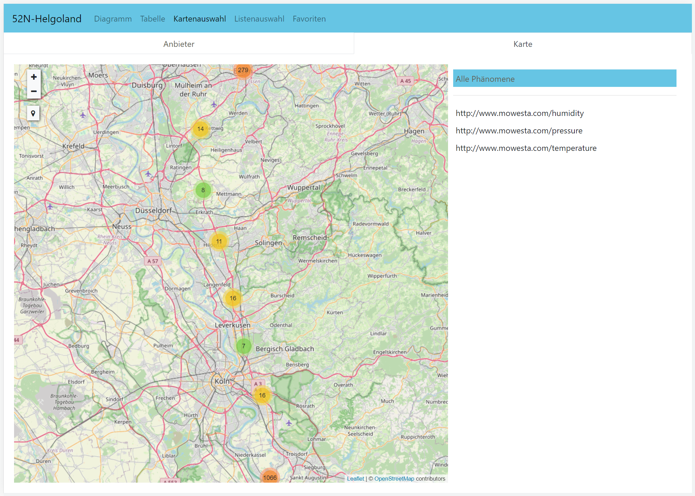
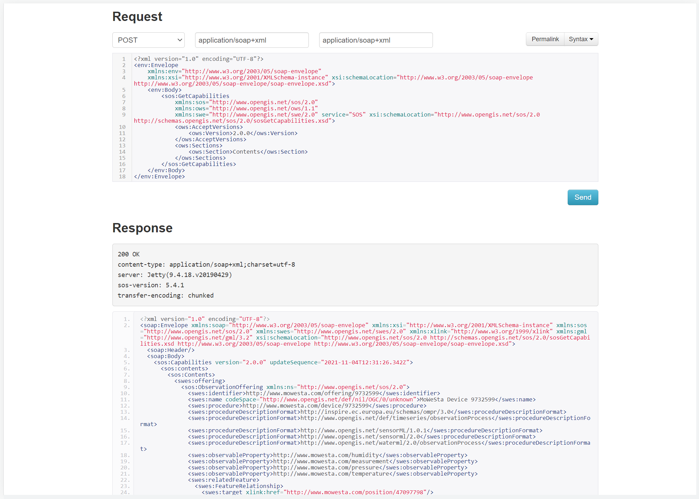

# MoWeSta Exporter for Sensor Observation Services

A simple tool to export device measurements stored in MoWeSta into an OGC-compliant Sensor Observation Service. After exporting the data, it can be queried by time and space using the standardized filtering functions defined by the [OGC SOS specification](https://www.ogc.org/standards/sos).

## Usage

Clone the repository and run ```./gradlew app:run``` in the root directory. This will generate the API client code for MoWeSta, compile the program and run it. If you do not specify any further parameters, the program will print the documentation of its command line parameters which reads:

```
usage: com.mowesta.tool.OGCExporter
 -d,--device <arg>     Device id of the device to export.
 -p,--password <arg>   Password to connect to MoWeSta.
 -t,--target <arg>     Target url of the Sensor Observation Service.
 -u,--username <arg>   User to connect to MoWeSta.
```

If you only specify a username and password, e.g. by running ```./gradlew app:run --args="-u mowesta_login -p mowesta_password"```, the program will list all devices that are bound to your account.

```
Devices in MoWeSta:
9732591 - ANDROID-Device samsung SM-G970F beyond0
9934722 - ANDROID-Device LENOVO Lenovo YT-X703F YT-X703F
9939083 - ANDROID-Device samsung SM-G935F hero2lte
10880984 - ARDUINO-Device MoWeSta Balkon Arduino
...
```

Now you can pick the device id that you want to export and rerun the program with the -d and -t option, e.g. ```./gradlew app:run --args="-u mowesta_login -p mowesta_password -d 9732591 -t sos_address"```. The tool will then login to MoWesta, download the device information and create an associated sensor in the Sensor Observation Service. Once the sensor has been created, the tool will page through all device measurements and create observations for each of them. The observations will contain the temperature, humidity and air pressure values, if present.

## Testing

An easy way to test the tool is to use the docker distribution of [52North's implementation of an OGC Sensor Observation Service](https://github.com/52North/SOS) that is available as open source on Github. If you have docker installed, you can run the service using ```docker run -p 8080:8080 52north/sos:5.4.1```. This will make the service available via http on port 8080. If you want to use an external url, you should reconfigure the settings.json file of the helgoland web application by adding the -v parameter ```docker run -p 8080:8080 -v /path/to/settings.json:/var/lib/jetty/webapps/ROOT/static/client/helgoland/assets/settings.json -p 8080:8080 52north/sos:5.4.1```. An minimal example settings.json looks like this: 

```
{
  "defaultProvider" : "localhost",
  "datasetApis": [
    {
      "name": "localhost",
      "url": "http://your.real.host.com:8080/api/"
    }
  ]
}
```

Note that the 52North Sensor Observation Service will make its SOAP endpoint available as ```/service```. So you should be specificing this as the -t parameter of the export tool. If you are running the docker on localhost, the correct command would be  ```./gradlew app:run --args="-u mowesta_login -p mowesta_password -d mowesta_device_id -t http://localhost:8080/service"```.

Once the export completes successfully, you can use the helgoland client that ships with the SOS to look at your data. In addition, you can use the service-endpoint to run queries.






## Customization

If you want to customize the data that is stored for your device, you can modify the xml templates in the resources folder (i.e., ```observation.xml``` and ```sensor.xml```). If you want to add more variables or change the variable assignment, take a look at the ```getVariables``` methods in ```OGCExporter.java```. Good luck!

## Limitations

The tool is simple and the implementation is a proof of concept and not a product. The return values of the SOS are not checked and importing a large dataset will result in a lot of http requests (i.e. one for each measurement). In addition, the output is quite verbose.

## License
```
Copyright 2021 Marcus Handte (marcus.handte@uni-due.de)

Permission is hereby granted, free of charge, to any person obtaining a copy of this software and associated documentation files (the "Software"), to deal in the Software without restriction, including without limitation the rights to use, copy, modify, merge, publish, distribute, sublicense, and/or sell copies of the Software, and to permit persons to whom the Software is furnished to do so, subject to the following conditions:

The above copyright notice and this permission notice shall be included in all copies or substantial portions of the Software.

THE SOFTWARE IS PROVIDED "AS IS", WITHOUT WARRANTY OF ANY KIND, EXPRESS OR IMPLIED, INCLUDING BUT NOT LIMITED TO THE WARRANTIES OF MERCHANTABILITY, FITNESS FOR A PARTICULAR PURPOSE AND NONINFRINGEMENT. IN NO EVENT SHALL THE AUTHORS OR COPYRIGHT HOLDERS BE LIABLE FOR ANY CLAIM, DAMAGES OR OTHER LIABILITY, WHETHER IN AN ACTION OF CONTRACT, TORT OR OTHERWISE, ARISING FROM, OUT OF OR IN CONNECTION WITH THE SOFTWARE OR THE USE OR OTHER DEALINGS IN THE SOFTWARE.
```